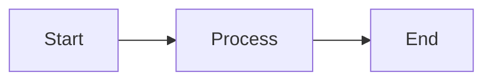

# Contributing to Nexus CMDB Documentation

Thank you for your interest in contributing to the Nexus CMDB documentation! This guide will help you understand our documentation philosophy and workflow.

## 📖 Documentation Philosophy

This project strictly follows the **[Diátaxis framework](https://diataxis.fr/)**, which organizes documentation into four distinct pillars based on the user's needs:

### 1. Tutorials (Learning-Oriented)

**Purpose**: Guide users through acquiring basic competence

**Characteristics**:
- Learning by doing
- Focused on getting started
- Takes user through series of steps to complete a project
- Inspires confidence through small wins
- Minimal explanation, maximum action

**Example**: "Create Your First CI" tutorial

### 2. How-To Guides (Task-Oriented)

**Purpose**: Show how to solve a specific problem

**Characteristics**:
- Problem-focused
- Assumes user has basic knowledge
- Series of steps to accomplish a goal
- Practical, not comprehensive
- Flexible enough to adapt to situations

**Example**: "How to Fix Duplicate Configuration Items"

### 3. Discussions (Understanding-Oriented)

**Purpose**: Explain concepts, provide context, offer perspective

**Characteristics**:
- Explains "why" not "how"
- Provides background and context
- Makes connections between topics
- Offers alternative approaches
- Discusses design decisions and tradeoffs

**Example**: "The Importance of Relationship Modeling"

### 4. Reference (Information-Oriented)

**Purpose**: Provide technical description of the machinery

**Characteristics**:
- Information-dense
- Structured, consistent format
- Accurate and complete
- No narrative or explanation
- Technical lookup documentation

**Example**: "CI Classes and Attributes Specification"

## 🎯 Placement Guidelines

Before creating or editing documentation, determine which pillar it belongs to:

| If the user wants to... | Create/edit in... |
|-------------------------|-------------------|
| Learn the basics | **Tutorials** |
| Solve a specific problem | **How-To Guides** |
| Understand a concept | **Discussions** |
| Look up technical details | **Reference** |

**Common Mistakes**:
- ❌ Putting explanations in tutorials (belongs in Discussions)
- ❌ Step-by-step guides in Reference (belongs in How-To or Tutorials)
- ❌ Technical specifications in Discussions (belongs in Reference)
- ❌ Problem-solving in Tutorials (belongs in How-To)

## 🚀 Getting Started

### Prerequisites

- Git
- Python 3.8+
- Text editor (VS Code recommended)

### Setup

1. Fork the repository
2. Clone your fork:
   ```bash
   git clone https://github.com/YOUR_USERNAME/nexus-cmdb-docs.git
   cd nexus-cmdb-docs
   ```
3. Create virtual environment:
   ```bash
   python3 -m venv venv
   source venv/bin/activate
   ```
4. Install dependencies:
   ```bash
   pip install -r requirements-dev.txt
   ```
5. Set up pre-commit hooks:
   ```bash
   pre-commit install
   pre-commit install --hook-type pre-push
   ```
6. Create a feature branch:
   ```bash
   git checkout -b feature/your-feature-name develop
   ```

## ✍️ Writing Guidelines

### General Principles

- **Clear and concise**: Avoid jargon, use simple language
- **Active voice**: "Click the button" not "The button should be clicked"
- **Present tense**: "The system validates" not "The system will validate"
- **Imperative mood** (for instructions): "Run the command" not "You should run"
- **Audience awareness**: Match technical depth to the documentation pillar

### Markdown Style

- Use ATX-style headers (`# Header`)
- Use dashes for lists (`-` not `*` or `+`)
- Keep lines under 120 characters
- One blank line around code blocks
- Two blank lines before `##` headers
- End files with newline

### Code Examples

- Always include language identifier for syntax highlighting:
  ````markdown
  ```python
  # Your code here
  ```
  ````
- Test all code examples before committing
- Use realistic, self-contained examples
- Include expected output when helpful

### Diagrams

Use Mermaid for diagrams:

````markdown

````

### Admonitions

Use admonitions to highlight important information:

```markdown
!!! note
    Additional information

!!! warning
    Cautionary advice

!!! tip
    Helpful suggestion

!!! danger
    Critical warning
```

## 🔍 Review Process

1. **Self-review checklist**:
   - [ ] Content is in the correct Diátaxis pillar
   - [ ] Pre-commit hooks pass (`pre-commit run --all-files`)
   - [ ] Site builds without errors (automatically checked by pre-push hook)
   - [ ] All links are valid
   - [ ] Code examples are tested
   - [ ] Previewed locally (`mkdocs serve`)

2. **Submit Pull Request**:
   - Use the PR template
   - Provide clear description
   - Link related issues
   - Request review from maintainers

3. **CI checks must pass**:
   - Markdown linting
   - Build verification
   - Link checking

4. **Maintainer review**:
   - Content accuracy
   - Diátaxis compliance
   - Writing quality
   - Technical correctness

## 🛠️ Tools

### Running Locally

```bash
mkdocs serve
```

Navigate to `http://127.0.0.1:8000`

### Git Hooks (Pre-commit)

Git hooks run automatically when you commit or push. To run manually:

```bash
# Run all hooks
pre-commit run --all-files

# Run specific hook
pre-commit run markdownlint-cli2 --all-files
```

Hooks include:
- Trailing whitespace removal
- End-of-file fixer
- YAML validation
- Markdown linting (pre-commit)
- MkDocs build check (pre-push)

### Building

```bash
mkdocs build --strict
```

### Checking Links

Install lychee:
```bash
cargo install lychee
```

Run checker:
```bash
lychee site/
```

## 🐛 Reporting Issues

Found a problem? [Open an issue](https://github.com/example-org/nexus-cmdb-docs/issues/new) with:

- Clear, descriptive title
- Steps to reproduce (if applicable)
- Expected vs actual behavior
- Screenshots (if relevant)
- Environment details

## 💡 Suggesting Enhancements

Have an idea? [Start a discussion](https://github.com/example-org/nexus-cmdb-docs/discussions/new) with:

- Clear description of the enhancement
- Why it would be valuable
- Potential implementation approach
- Examples from other documentation sites

## 📋 Pull Request Template

Our PR template includes:

- Description of changes
- Type of change (content, bug fix, new section, etc.)
- Affected Diátaxis pillar
- Checklist for quality assurance
- Related issues

## 🤝 Code of Conduct

This project adheres to a code of conduct. By participating, you agree to:

- Be respectful and inclusive
- Accept constructive criticism gracefully
- Focus on what's best for the community
- Show empathy towards other contributors

## 📚 Resources

- [Diátaxis Framework](https://diataxis.fr/)
- [MkDocs Documentation](https://www.mkdocs.org/)
- [Material for MkDocs](https://squidfunk.github.io/mkdocs-material/)
- [Markdown Guide](https://www.markdownguide.org/)
- [Google Developer Documentation Style Guide](https://developers.google.com/style)

## 🙏 Recognition

Contributors are recognized in:

- GitHub contributors page
- Release notes
- Annual contributor acknowledgment

Thank you for helping improve Nexus CMDB documentation!
