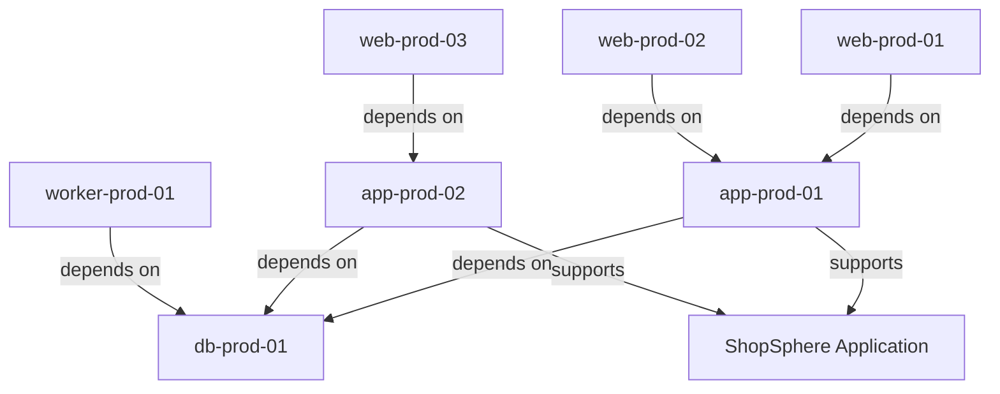

# Why Relationship Modeling Matters

Configuration items don't exist in isolation. A web server depends on a database. An application runs on virtual machines. A load balancer distributes traffic to backend services. Understanding these connections—the **relationships** between CIs—is what transforms a simple asset database into a true Configuration Management Database.

## The Asset Database Trap

Many organizations start their CMDB journey by cataloging assets:

- Inventory of servers
- List of applications
- Database of network devices
- Spreadsheet of cloud resources

This creates an **asset database**: a flat list of things you own. Asset databases answer questions like:

- How many servers do we have?
- What OS versions are deployed?
- Who owns this application?

These are useful questions, but they're insufficient for operational decision-making.

## What's Missing: Context

Without relationships, you can't answer:

- **Impact Analysis**: "If I reboot this database, what breaks?"
- **Dependency Mapping**: "What does this application need to function?"
- **Root Cause Analysis**: "Why did the website go down when the cache server failed?"
- **Change Risk**: "Is it safe to patch this server during business hours?"

These questions require understanding **how things connect**—not just **what things exist**.

## Relationships Provide Operational Context

### Example: Server Maintenance

You need to patch `db-prod-01`. Your asset database tells you:

```yaml
Name: db-prod-01
Type: PostgreSQL Database
Owner: Data Team
Environment: Production
```

Useful, but incomplete. With relationship modeling, you see:



Now you understand:

- **Direct Impact**: 2 app servers and 1 worker depend on this database
- **Cascading Impact**: 3 web servers indirectly affected (via app servers)
- **Business Impact**: The entire ShopSphere application will be unavailable
- **Risk Level**: **CRITICAL** - this is a single point of failure

**Decision**: Schedule maintenance during off-hours, have rollback plan ready.

Without relationship modeling, you might have patched during business hours, causing an unexpected outage.

## Relationships Are Not Foreign Keys

A common misconception: "We have foreign keys in our database, so we have relationships."

Database foreign keys enforce **referential integrity**. CMDB relationships provide **semantic meaning**.

### Foreign Key

```sql
CREATE TABLE servers (
  id INTEGER PRIMARY KEY,
  database_id INTEGER REFERENCES databases(id)
);
```

This says: "A server has a database ID, and that ID must exist in the databases table."

### CMDB Relationship

```json
{
  "source_ci": "app-server-01",
  "target_ci": "postgres-db-01",
  "relationship_type": "depends_on",
  "criticality": "high",
  "metadata": {
    "connection_type": "postgresql",
    "pool_size": 20,
    "failover_enabled": true
  }
}
```

This says:

- `app-server-01` **depends on** `postgres-db-01` (semantic meaning)
- This dependency is **high criticality** (impact classification)
- Connection uses **PostgreSQL protocol** (technical detail)
- **Failover is enabled** (resilience information)

The CMDB relationship answers:

- **What**: app-server-01 connects to postgres-db-01
- **How**: via PostgreSQL protocol with connection pool of 20
- **Why**: because the app depends on this database
- **Impact**: high criticality if database unavailable

Foreign keys only answer "what."

## Types of Relationships Matter

Different relationship types convey different operational semantics:

### Depends On

**A depends on B**: A cannot function without B

- Web server depends on app server
- App server depends on database
- Application depends on load balancer

**Implication**: If B fails, A fails (or degrades)

### Hosts

**A hosts B**: A provides runtime environment for B

- Virtual machine hosts application
- Kubernetes cluster hosts pods
- Server hosts containers

**Implication**: If A is rebooted, B is disrupted

### Connects To

**A connects to B**: A communicates with B

- Server connects to switch
- Application connects to API
- Service connects to message queue

**Implication**: Network path between A and B must be available

### Member Of

**A is member of B**: A belongs to cluster/group B

- Node member of Kubernetes cluster
- Server member of load balancer pool
- Database member of replication set

**Implication**: A shares fate with other members of B

Each relationship type enables different analyses and automation.

## Bidirectional Relationships

Some relationships have implicit inverses:

- **Depends On** ↔ **Depended On By**
- **Hosts** ↔ **Hosted On**
- **Parent** ↔ **Child**

Nexus tracks both directions automatically, enabling:

- **Downstream Analysis**: "What depends on this CI?"
- **Upstream Analysis**: "What does this CI depend on?"

Example queries:

```bash
# What depends on db-prod-01?
GET /api/v1/cis/db-prod-01/upstream

# What does app-prod-01 depend on?
GET /api/v1/cis/app-prod-01/downstream
```

## Relationship Attributes Enrich Context

Relationships aren't just source→target pointers. They carry metadata:

### Criticality

```json
{
  "criticality": "high",
  "sla_impact": "critical"
}
```

Indicates this relationship matters for SLA compliance.

### Connection Details

```json
{
  "protocol": "https",
  "port": 443,
  "endpoint": "https://api.example.com/v1"
}
```

Enables automated connectivity testing and troubleshooting.

### Capacity Information

```json
{
  "weight": 33,
  "max_connections": 100,
  "current_load": 42
}
```

Useful for load balancing and capacity planning.

### Temporal Information

```json
{
  "valid_from": "2026-01-01T00:00:00Z",
  "valid_until": "2026-12-31T23:59:59Z"
}
```

Tracks relationships that expire or evolve over time.

## Enables Advanced Automation

Relationship modeling unlocks sophisticated automation:

### Impact-Aware Change Management

```python
def can_deploy_safely(ci_name):
    # Get all upstream dependencies
    affected = get_upstream_dependencies(ci_name)

    # Check SLA requirements
    critical_cis = [ci for ci in affected if ci.sla_tier == "critical"]

    if critical_cis and is_business_hours():
        return False, "Would impact critical services during business hours"

    return True, f"Safe to deploy. Would affect {len(affected)} CIs."
```

### Intelligent Monitoring

```python
def detect_root_cause(failed_ci):
    # Check downstream dependencies
    dependencies = get_downstream_dependencies(failed_ci)

    for dep in dependencies:
        if dep.status == "failed":
            # Likely root cause: dependency failed first
            return dep

    # This CI is the root cause
    return failed_ci
```

### Capacity Planning

```python
def calculate_total_cost(application):
    # Traverse all hosting relationships
    infrastructure = get_all_hosts(application)

    total_cost = sum(ci.monthly_cost for ci in infrastructure)
    return total_cost
```

## When Relationships Aren't Needed

Relationship modeling isn't free—it requires maintenance. Don't create relationships when:

### The Connection Is Implicit

**Bad**: Server `web-01` "connects to" network device `switch-01`

This is implied by network topology. Model network segments instead:

```json
{
  "ci": "web-01",
  "attributes": {
    "network_segment": "prod-dmz-subnet-1"
  }
}
```

### The Relationship Adds No Operational Value

**Bad**: Server `web-01` "located in" datacenter `DC-1`

Use an attribute instead:

```json
{
  "ci": "web-01",
  "attributes": {
    "datacenter": "DC-1"
  }
}
```

Relationships should answer "what happens if..." questions.

### The Relationship Is Too Granular

**Bad**: Tracking every TCP connection

Don't model:

- `web-01:443` → `app-01:8080`
- `app-01:5432` → `db-01:5432`

This creates noise. Model at service level:

- `web-service` → `app-service`
- `app-service` → `database`

## Common Misconceptions

### "We Can Infer Relationships from Logs"

Observability tools (APM, distributed tracing) can **discover** relationships, but they can't:

- Understand **intent** (why does A depend on B?)
- Provide **metadata** (how critical is this connection?)
- Model **planned** relationships (before deployment)
- Capture **non-technical** dependencies (licensing, contracts)

Use observability for discovery, CMDB for authoritative modeling.

### "Relationships Are Too Hard to Maintain"

Initially, yes. But:

- **Discovery automation** maintains most relationships
- **Validation rules** catch inconsistencies
- **API integrations** sync with IaC tools
- **Teams own their services' relationships** (federated model)

The alternative—no relationships—leads to:

- Outages from unexpected dependencies
- Failed change management
- Ineffective incident response
- Inability to understand system behavior

The maintenance cost is worth the operational benefit.

## Relationship Anti-Patterns

### Over-Modeling

Creating relationships for everything:

- Server "uses" keyboard
- Application "has" logo file
- Network "contains" packets

These don't provide operational value. Model only **operationally significant** connections.

### Stale Relationships

Relationships that are never updated:

- Server decommissioned, relationships remain
- Application migrated, old dependencies still modeled
- Infrastructure refactored, relationships not updated

**Solution**: Automated cleanup, validation rules, periodic audits.

### Missing Context

Relationships without metadata:

```json
{
  "source": "web-01",
  "target": "db-01",
  "type": "depends_on"
}
```

**Why** does web-01 depend on db-01? What happens if db-01 fails?

Add context:

```json
{
  "source": "web-01",
  "target": "db-01",
  "type": "depends_on",
  "criticality": "high",
  "metadata": {
    "purpose": "user_authentication",
    "failover": "fallback_to_ldap"
  }
}
```

Now it's actionable.

## Conclusion

Relationship modeling transforms your CMDB from a static asset inventory into a dynamic, queryable representation of your infrastructure's operational reality. It enables:

- **Impact analysis**: Understand blast radius before changes
- **Root cause analysis**: Trace failures through dependencies
- **Intelligent automation**: Make context-aware decisions
- **Risk assessment**: Identify single points of failure

The investment in modeling relationships pays dividends in operational excellence, reduced outages, and faster incident response.

## See Also

- [Designing Advanced Relationships](../tutorials/advanced-relationships.md): Practical tutorial on relationship modeling
- [Relationships Reference](../reference/relationships.md): Technical documentation of relationship types
- [CMDB Anti-Patterns](anti-patterns.md): Common mistakes to avoid
