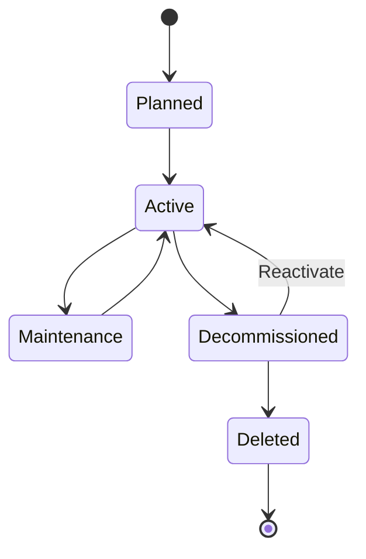

# Data Lifecycle

This document describes how configuration items and relationships progress through their lifecycle in Nexus CMDB—from creation to deletion—and how state transitions are tracked.

## CI Lifecycle States



### Planned

CI is defined but not yet deployed.

**Use Cases**: Pre-production planning, capacity forecasting

**Transitions To**: Active

---

### Active

CI is operational and in use.

**Use Cases**: Normal operation

**Transitions To**: Maintenance, Decommissioned

---

### Maintenance

CI is temporarily offline for updates or repairs.

**Use Cases**: Patching, upgrades, troubleshooting

**Transitions To**: Active

---

### Decommissioned

CI is marked for removal but not yet deleted.

**Use Cases**: Grace period before deletion, audit trail

**Transitions To**: Deleted, Active (reactivation)

**Default Retention**: 30 days before auto-deletion

---

### Deleted

CI is removed from active database.

**Soft Delete**: CI moved to archived table, recoverable for 30 days

**Hard Delete**: CI permanently purged after retention period

---

## CRUD Operations

### Create

#### API Request

```bash
POST /api/v1/cis
Content-Type: application/json

{
  "name": "web-prod-01",
  "ci_class": "Server",
  "ip_address": "10.0.1.42",
  "operating_system": "Ubuntu 22.04",
  "environment": "Production"
}
```

#### Response

```json
{
  "ci_id": "ci_a1b2c3",
  "name": "web-prod-01",
  "ci_class": "Server",
  "ip_address": "10.0.1.42",
  "operating_system": "Ubuntu 22.04",
  "environment": "Production",
  "status": "Active",
  "created_at": "2026-01-07T10:30:00Z",
  "created_by": "user@example.com"
}
```

#### Side Effects

- Unique `ci_id` generated
- `created_at` timestamp set
- `created_by` set to authenticated user
- Audit log entry created
- Status defaults to "Active" unless specified

---

### Read

#### Get Single CI

```bash
GET /api/v1/cis/{ci_id}
```

#### Query Multiple CIs

```bash
GET /api/v1/cis?environment=Production&ci_class=Server&limit=50
```

#### Supported Query Parameters

- `environment`: Filter by environment
- `ci_class`: Filter by CI class
- `owner`: Filter by owner
- `tags`: Filter by tags
- `limit`: Max results (default: 100)
- `offset`: Pagination offset

---

### Update

#### Full Update (PUT)

```bash
PUT /api/v1/cis/{ci_id}
Content-Type: application/json

{
  "name": "web-prod-01",
  "ip_address": "10.0.1.43",
  "operating_system": "Ubuntu 24.04",
  ...
}
```

Replaces entire CI. All fields must be provided.

#### Partial Update (PATCH)

```bash
PATCH /api/v1/cis/{ci_id}
Content-Type: application/json

{
  "ip_address": "10.0.1.43"
}
```

Updates only specified fields.

#### Side Effects

- `updated_at` timestamp updated
- `updated_by` set to authenticated user
- Audit log entry created
- Version number incremented

---

### Delete

#### Soft Delete (Default)

```bash
DELETE /api/v1/cis/{ci_id}
```

CI marked as deleted, moved to soft-delete table, recoverable for 30 days.

#### Hard Delete (Immediate)

```bash
DELETE /api/v1/cis/{ci_id}?hard=true
```

CI permanently removed. Cannot be recovered.

#### Cascade Options

```bash
DELETE /api/v1/cis/{ci_id}?cascade=true
```

Deletes all relationships automatically. Without `cascade=true`, deletion fails if relationships exist.

---

## Audit Trail

Every CI operation is logged:

```json
{
  "audit_id": "audit_123456",
  "ci_id": "ci_a1b2c3",
  "ci_name": "web-prod-01",
  "operation": "UPDATE",
  "timestamp": "2026-01-07T10:30:00Z",
  "user": "engineer@example.com",
  "changes": {
    "ip_address": {
      "old": "10.0.1.42",
      "new": "10.0.1.43"
    }
  }
}
```

### Query Audit Log

```bash
GET /api/v1/audit?ci_id={ci_id}&limit=50
```

Returns chronological history of all changes to a CI.

---

## Versioning

Nexus tracks CI versions:

```json
{
  "ci_id": "ci_a1b2c3",
  "version": 5,
  "version_history": [
    {
      "version": 4,
      "timestamp": "2026-01-01T00:00:00Z",
      "changed_by": "automation@example.com",
      "changes": ["ip_address"]
    },
    {
      "version": 3,
      "timestamp": "2025-12-15T10:00:00Z",
      "changed_by": "engineer@example.com",
      "changes": ["owner"]
    }
  ]
}
```

### Get Specific Version

```bash
GET /api/v1/cis/{ci_id}?version=3
```

Returns CI as it existed at version 3.

---

## Relationship Lifecycle

Relationships follow similar lifecycle:

1. **Created**: When explicitly created or auto-discovered
2. **Active**: Relationship exists and is valid
3. **Deprecated**: Marked for removal but not deleted
4. **Deleted**: Removed from database

### Orphaned Relationships

When a CI is deleted:

- `cascade=true`: Relationships auto-deleted
- `cascade=false`: Relationships become orphaned

See [Handling Orphaned Relationships](../how-to/handle-orphaned-relationships.md).

---

## Soft Delete Recovery

Recover a soft-deleted CI:

```bash
POST /api/v1/cis/{ci_id}/restore
```

Moves CI from soft-delete table back to active CIs.

---

## See Also

- [CI Classes](ci-classes.md): Schema definitions
- [API Conventions](api-conventions.md): API patterns and authentication
- [Validation Rules](validation-rules.md): Data quality enforcement
