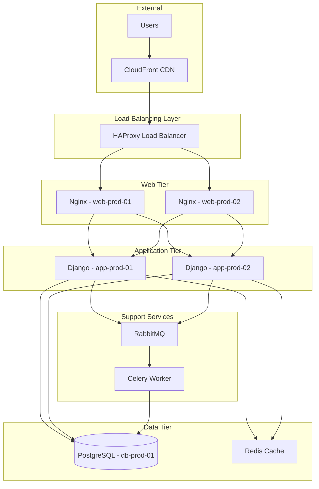

# Designing Advanced Relationships

In this tutorial, you'll master relationship modeling by building a complex multi-tier application stack. You'll learn different relationship types, understand bidirectional dependencies, and perform impact analysis.

!!! tip "What You'll Build"
    A complete application dependency map showing:

    - Hosting relationships (VM hosts application)
    - Dependencies (app depends on database)
    - Load balancing (LB distributes to multiple backends)
    - Network connectivity
    - Service-to-service communication

**Time Required**: 60 minutes  
**Difficulty**: Advanced  
**Prerequisites**:

- Completed [Modeling Infrastructure Assets](modeling-infrastructure.md)
- Understanding of multi-tier architectures

---

## Scenario: E-commerce Application Stack

You'll model the complete infrastructure for "ShopSphere", including all components and their interdependencies.

### Architecture Overview



---

## Understanding Relationship Types

Before creating relationships, understand what Nexus offers:

### Relationship Types in Nexus

| Type | Description | Example | Bidirectional |
|------|-------------|---------|---------------|
| **Depends On** | A requires B to function | App depends on Database | No |
| **Hosts** | A provides runtime for B | VM hosts Application | No |
| **Connects To** | A communicates with B | Server connects to Switch | No |
| **Backed By** | A is distributed across multiple B | LB backed by Web Servers | Yes |
| **Member Of** | A belongs to cluster B | Node member of Cluster | No |
| **Parent/Child** | Hierarchical relationship | Org Unit contains Team | Yes |

### Relationship Attributes

Each relationship can have:

- **Type**: The semantic meaning
- **Weight**: Priority or strength (1-100)
- **Status**: Active, Deprecated, Planned
- **Created**: Timestamp
- **Metadata**: Custom key-value pairs

---

## Step 1: Create Infrastructure CIs

First, create all the CIs we'll connect. If you completed the [Modeling Infrastructure tutorial](modeling-infrastructure.md), you already have some of these.

### Create Missing CIs

Create these additional CIs:

#### Redis Cache Server

```yaml
CI Class: Server
Name: redis-prod-01
IP Address: 10.0.5.10
Operating System: Ubuntu 22.04 LTS
Environment: Production
Owner: Platform Team
CPU Cores: 4
Memory (GB): 32
Role: Cache Server
```

#### RabbitMQ Server

```yaml
CI Class: Server
Name: rabbitmq-prod-01
IP Address: 10.0.6.10
Operating System: Ubuntu 22.04 LTS
Environment: Production
Owner: Platform Team
CPU Cores: 8
Memory (GB): 32
Role: Message Queue
```

#### Celery Worker

```yaml
CI Class: Server
Name: worker-prod-01
IP Address: 10.0.7.10
Operating System: Ubuntu 22.04 LTS
Environment: Production
Owner: Engineering Team
CPU Cores: 8
Memory (GB: 16
Role: Background Worker
```

#### CDN

```yaml
CI Class: Network Device
Type: CDN
Name: cloudfront-shopsphere
Vendor: AWS CloudFront
Distribution ID: E2QWRTYUIOP123
Environment: Production
Owner: Platform Team
```

---

## Step 2: Create Load Balancing Relationships

Connect the load balancer to web servers using "Backed By" relationships.

### Using the UI

1. Navigate to **lb-prod-01** detail page
2. Click **Relationships** tab
3. Click **+ Add Relationship**
4. Fill in:
   - **Relationship Type**: Backed By
   - **Target CI**: web-prod-01
   - **Weight**: 33
   - **Status**: Active
5. Click **Add**

Repeat for `web-prod-02` and `web-prod-03`.

### Using the API

Create all three relationships at once:

```bash
curl -u admin:changeme \
  -X POST \
  -H "Content-Type: application/json" \
  -d '{
    "relationships": [
      {
        "source_ci": "lb-prod-01",
        "target_ci": "web-prod-01",
        "type": "backed_by",
        "weight": 33
      },
      {
        "source_ci": "lb-prod-01",
        "target_ci": "web-prod-02",
        "type": "backed_by",
        "weight": 33
      },
      {
        "source_ci": "lb-prod-01",
        "target_ci": "web-prod-03",
        "type": "backed_by",
        "weight": 34
      }
    ]
  }' \
  http://localhost:8080/api/v1/relationships/batch
```

!!! note "Weight Distribution"
    Weights represent load distribution. Here, traffic is split ~33%/33%/34% across three servers.

---

## Step 3: Create Web-to-App Tier Relationships

Web servers proxy requests to application servers.

### Batch Create Relationships

```bash
curl -u admin:changeme \
  -X POST \
  -H "Content-Type: application/json" \
  -d '{
    "relationships": [
      {"source_ci": "web-prod-01", "target_ci": "app-prod-01", "type": "depends_on"},
      {"source_ci": "web-prod-01", "target_ci": "app-prod-02", "type": "depends_on"},
      {"source_ci": "web-prod-02", "target_ci": "app-prod-01", "type": "depends_on"},
      {"source_ci": "web-prod-02", "target_ci": "app-prod-02", "type": "depends_on"},
      {"source_ci": "web-prod-03", "target_ci": "app-prod-01", "type": "depends_on"},
      {"source_ci": "web-prod-03", "target_ci": "app-prod-02", "type": "depends_on"}
    ]
  }' \
  http://localhost:8080/api/v1/relationships/batch
```

This creates a fully-meshed web-to-app tier: any web server can forward to any app server.

---

## Step 4: Create Data Tier Relationships

Application servers depend on database and cache.

### App to Database

```bash
curl -u admin:changeme \
  -X POST \
  -H "Content-Type: application/json" \
  -d '{
    "relationships": [
      {
        "source_ci": "app-prod-01",
        "target_ci": "db-prod-01",
        "type": "depends_on",
        "metadata": {"connection_type": "postgresql", "pool_size": 20}
      },
      {
        "source_ci": "app-prod-02",
        "target_ci": "db-prod-01",
        "type": "depends_on",
        "metadata": {"connection_type": "postgresql", "pool_size": 20}
      }
    ]
  }' \
  http://localhost:8080/api/v1/relationships/batch
```

### App to Redis Cache

```bash
curl -u admin:changeme \
  -X POST \
  -H "Content-Type: application/json" \
  -d '{
    "relationships": [
      {
        "source_ci": "app-prod-01",
        "target_ci": "redis-prod-01",
        "type": "depends_on",
        "metadata": {"purpose": "session_cache", "ttl_seconds": 3600}
      },
      {
        "source_ci": "app-prod-02",
        "target_ci": "redis-prod-01",
        "type": "depends_on",
        "metadata": {"purpose": "session_cache", "ttl_seconds": 3600}
      }
    ]
  }' \
  http://localhost:8080/api/v1/relationships/batch
```

---

## Step 5: Create Async Processing Relationships

Model the message queue and worker infrastructure.

### App to RabbitMQ

```bash
curl -u admin:changeme \
  -X POST \
  -H "Content-Type: application/json" \
  -d '{
    "relationships": [
      {"source_ci": "app-prod-01", "target_ci": "rabbitmq-prod-01", "type": "depends_on"},
      {"source_ci": "app-prod-02", "target_ci": "rabbitmq-prod-01", "type": "depends_on"}
    ]
  }' \
  http://localhost:8080/api/v1/relationships/batch
```

### RabbitMQ to Worker

```bash
curl -u admin:changeme \
  -X POST \
  -H "Content-Type: application/json" \
  -d '{
    "source_ci": "rabbitmq-prod-01",
    "target_ci": "worker-prod-01",
    "type": "connects_to",
    "metadata": {"queue": "default", "prefetch_count": 10}
  }' \
  http://localhost:8080/api/v1/relationships
```

### Worker to Database

```bash
curl -u admin:changeme \
  -X POST \
  -H "Content-Type: application/json" \
  -d '{
    "source_ci": "worker-prod-01",
    "target_ci": "db-prod-01",
    "type": "depends_on"
  }' \
  http://localhost:8080/api/v1/relationships
```

---

## Step 6: Add CDN Edge Layer

Connect the CDN to the load balancer.

```bash
curl -u admin:changeme \
  -X POST \
  -H "Content-Type: application/json" \
  -d '{
    "source_ci": "cloudfront-shopsphere",
    "target_ci": "lb-prod-01",
    "type": "depends_on",
    "metadata": {"origin_protocol": "https", "origin_port": 443}
  }' \
  http://localhost:8080/api/v1/relationships
```

---

## Step 7: Visualize the Dependency Graph

### View in UI

1. Navigate to **CIs** → **lb-prod-01**
2. Click **Dependency Graph** tab
3. Select **Show Downstream** (default shows 2 levels deep)
4. Click **Expand All** to see the full tree

You should see:

```
lb-prod-01
├── web-prod-01
│   ├── app-prod-01
│   │   ├── db-prod-01
│   │   ├── redis-prod-01
│   │   └── rabbitmq-prod-01
│   └── app-prod-02
│       ├── db-prod-01 (already shown)
│       ├── redis-prod-01 (already shown)
│       └── rabbitmq-prod-01 (already shown)
├── web-prod-02
│   └── (same as web-prod-01)
└── web-prod-03
    └── (same as web-prod-01)
```

### Query via API

Get all dependencies for a CI:

```bash
curl -u admin:changeme \
  "http://localhost:8080/api/v1/cis/lb-prod-01/dependencies?depth=5"
```

---

## Step 8: Perform Impact Analysis

Now the real power: understanding blast radius.

### Scenario: Database Maintenance

**Question**: "If we take `db-prod-01` offline for maintenance, what's impacted?"

#### Find Upstream Dependencies

```bash
curl -u admin:changeme \
  "http://localhost:8080/api/v1/cis/db-prod-01/upstream"
```

Response shows all CIs that depend on the database:

```json
{
  "ci": "db-prod-01",
  "upstream_dependencies": [
    {"ci_name": "app-prod-01", "relationship": "depends_on", "distance": 1},
    {"ci_name": "app-prod-02", "relationship": "depends_on", "distance": 1},
    {"ci_name": "worker-prod-01", "relationship": "depends_on", "distance": 1},
    {"ci_name": "web-prod-01", "relationship": "depends_on", "distance": 2},
    {"ci_name": "web-prod-02", "relationship": "depends_on", "distance": 2},
    {"ci_name": "web-prod-03", "relationship": "depends_on", "distance": 2},
    {"ci_name": "lb-prod-01", "relationship": "backed_by", "distance": 3},
    {"ci_name": "cloudfront-shopsphere", "relationship": "depends_on", "distance": 4}
  ],
  "total_impacted": 8
}
```

**Answer**: All 8 components are impacted—the entire stack depends on the database!

### Using the Impact Analyzer

The UI provides a visual impact analyzer:

1. Navigate to **Tools** → **Impact Analysis**
2. Select CI: `db-prod-01`
3. Choose **Simulate Outage**
4. Click **Analyze**

Results show:

- **Direct Impact**: 3 CIs (app-prod-01, app-prod-02, worker-prod-01)
- **Cascading Impact**: 5 CIs (all web servers, LB, CDN)
- **Total Services Affected**: ShopSphere application (full outage)
- **Risk Level**: **CRITICAL**

---

## Step 9: Model Redundancy and Failover

Not all dependencies cause full outages. Model Redis as optional.

### Update Redis Relationships

Mark Redis as non-critical:

```bash
curl -u admin:changeme \
  -X PATCH \
  -H "Content-Type: application/json" \
  -d '{
    "metadata": {
      "purpose": "session_cache",
      "ttl_seconds": 3600,
      "criticality": "low",
      "fallback": "database_sessions"
    }
  }' \
  http://localhost:8080/api/v1/relationships/app-prod-01/redis-prod-01
```

### Re-run Impact Analysis

Now when you simulate `redis-prod-01` outage:

- **Direct Impact**: 2 CIs (app servers)
- **Service Degradation**: Performance impact, but no outage
- **Risk Level**: **MEDIUM** (degraded, not down)

---

## What You Learned

Congratulations! You've:

- ✅ Created complex multi-layered relationships
- ✅ Modeled different relationship types (depends, hosts, backed by)
- ✅ Added metadata to relationships
- ✅ Visualized dependency graphs
- ✅ Performed impact analysis
- ✅ Modeled redundancy and criticality

---

## Next Steps

Master advanced relationship concepts:

- **[Handling Orphaned Relationships](../how-to/handle-orphaned-relationships.md)**: Clean up invalid links
- **[Why Relationship Modeling Matters](../discussions/relationship-modeling.md)**: Understand the philosophy
- Review [Relationships Reference](../reference/relationships.md) for all relationship types

---

## Best Practices

### Keep Relationships Current

Relationships become stale as infrastructure changes:

- Automate relationship discovery where possible
- Review relationships quarterly
- Delete deprecated CIs and their relationships

### Document Relationship Semantics

Use metadata to clarify:

```json
{
  "purpose": "session_persistence",
  "protocol": "redis",
  "port": 6379,
  "criticality": "low"
}
```

This helps future engineers understand *why* the relationship exists.

### Model Both Directions

Some relationships are bidirectional:

- **Parent/Child**: Automatically creates inverse
- **Backed By**: Also creates "Backs" relationship
- **Depends On**: Only one direction (intentional)

Understand which relationships auto-create inverses.

### Use Weights Meaningfully

Weights (1-100) can represent:

- Load distribution percentages
- Priority (1=highest, 100=lowest)
- Connection count
- Capacity allocation

Be consistent across your organization.

---

## Troubleshooting

### Relationship Already Exists

If you get "Relationship already exists":

- Relationships are unique per source→target→type combination
- You can't create `app-prod-01 depends_on db-prod-01` twice
- To modify, use PATCH to update existing relationship

### Circular Dependencies Detected

Nexus warns about circular dependencies:

```
A depends on B
B depends on C
C depends on A  ← Creates cycle!
```

This is usually a modeling error. Review your architecture.

### Can't Delete CI with Relationships

To delete a CI that has relationships:

1. Delete all relationships first (or use `force=true`)
2. Then delete the CI

```bash
curl -u admin:changeme \
  -X DELETE \
  "http://localhost:8080/api/v1/cis/web-prod-01?force=true"
```

This cascades and removes relationships automatically.
