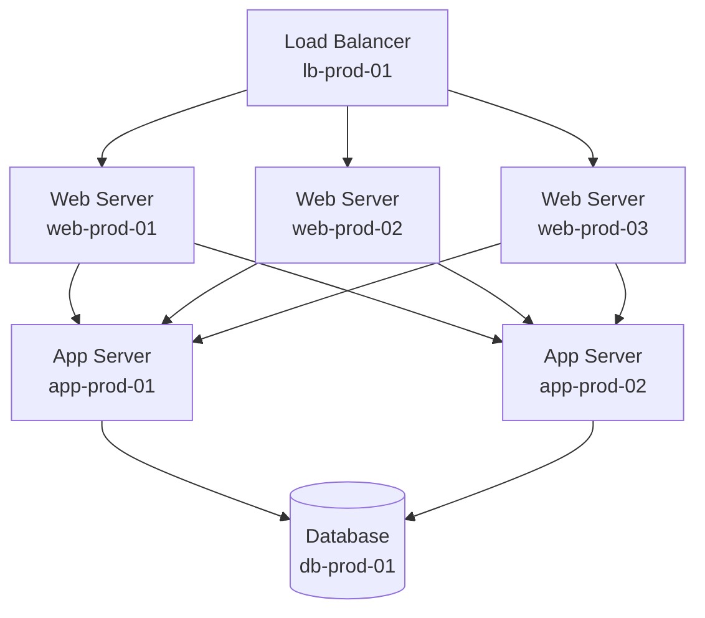

# Modeling Infrastructure Assets

In this tutorial, you'll build a realistic infrastructure model representing a complete application stack. You'll create multiple CIs across different classes and organize them into meaningful hierarchies.

!!! tip "What You'll Build"
    A three-tier web application infrastructure including:

    - 3 web servers
    - 2 application servers
    - 1 database server
    - 1 load balancer
    - 1 application CI tying them together

**Time Required**: 30 minutes  
**Difficulty**: Beginner  
**Prerequisites**: Completed [Creating Your First CI](first-ci.md)

---

## Scenario: E-commerce Platform

You're modeling the infrastructure for an e-commerce platform called "ShopSphere". The architecture follows a classic three-tier pattern:



---

## Step 1: Create the Load Balancer

### Navigate to Create CI

From the Nexus dashboard:

1. Click **CIs** → **+ New CI**
2. Select **Network Device** as the CI class
3. Choose **Load Balancer** as the subtype

### Enter Load Balancer Details

```yaml
Name: lb-prod-01
Type: Load Balancer
Vendor: HAProxy
IP Address: 10.0.1.10
Environment: Production
Cluster: us-east-1
Owner: Network Team
Capacity (requests/sec): 50000
```

Click **Create CI**.

---

## Step 2: Create Web Servers

We need three identical web servers. You'll create the first manually, then use duplication for the others.

### Create web-prod-01

1. **CIs** → **+ New CI** → **Server**

```yaml
Name: web-prod-01
Hostname: web-prod-01.shopsphere.internal
IP Address: 10.0.2.11
Operating System: Ubuntu 22.04 LTS
Environment: Production
Owner: Platform Team
CPU Cores: 8
Memory (GB): 32
Role: Web Server
```

### Duplicate for Remaining Servers

Instead of manually creating each server:

1. Click on **web-prod-01** in the CI list
2. Click **Actions** → **Duplicate CI**
3. Update the name to `web-prod-02`
4. Update IP to `10.0.2.12`
5. Click **Create CI**
6. Repeat for `web-prod-03` with IP `10.0.2.13`

!!! success "Pro Tip"
    Duplication copies all attributes from the source CI, saving time when creating similar CIs.

---

## Step 3: Create Application Servers

Application servers handle business logic. Create two of them:

### Create app-prod-01

1. **CIs** → **+ New CI** → **Server**

```yaml
Name: app-prod-01
Hostname: app-prod-01.shopsphere.internal
IP Address: 10.0.3.21
Operating System: Ubuntu 22.04 LTS
Environment: Production
Owner: Platform Team
CPU Cores: 16
Memory (GB): 64
Role: Application Server
```

### Create app-prod-02

Use duplication:

1. Duplicate **app-prod-01**
2. Name: `app-prod-02`
3. IP: `10.0.3.22`

---

## Step 4: Create the Database Server

The database requires more resources:

1. **CIs** → **+ New CI** → **Server**

```yaml
Name: db-prod-01
Hostname: db-prod-01.shopsphere.internal
IP Address: 10.0.4.30
Operating System: Ubuntu 22.04 LTS
Environment: Production
Owner: Data Team
CPU Cores: 32
Memory (GB): 256
Storage (GB): 4096
Role: Database Server
Database Engine: PostgreSQL 15
```

---

## Step 5: Create the Application CI

The application itself is also a CI:

1. **CIs** → **+ New CI** → **Application**

```yaml
Name: ShopSphere
Display Name: ShopSphere E-commerce Platform
Version: 2.4.0
Environment: Production
Owner: Engineering Team
Language: Python 3.11
Framework: Django 4.2
Repository: github.com/shopsphere/platform
Status: Active
```

---

## Step 6: Organize with Tags

Tags help categorize CIs. Let's add tags to our infrastructure:

### Add Tags to All CIs

For each CI you created:

1. Open the CI detail page
2. Click **Add Tag**
3. Add these tags:
   - `project:shopsphere`
   - `tier:production`
   - `region:us-east-1`

Additionally, add role-specific tags:

| CI Type | Additional Tag |
|---------|---------------|
| Load Balancer | `layer:network` |
| Web Servers | `layer:web` |
| App Servers | `layer:application` |
| Database | `layer:data` |
| Application | `type:application` |

---

## Step 7: Verify Your Model

### View All CIs

Navigate to **CIs** and apply filter:

```
Environment = Production
```

You should see 8 CIs:

- 1 load balancer
- 3 web servers
- 2 app servers
- 1 database
- 1 application

### Verify Naming Convention

All your server names should follow the pattern:

```
{role}-{environment}-{number}
```

Examples: `web-prod-01`, `app-prod-02`, `db-prod-01`

!!! note "Naming Conventions"
    Consistent naming makes automation and filtering much easier. See [Migrating Naming Conventions](../how-to/migrate-naming-conventions.md) if you need to update existing CIs.

---

## Step 8: Export Your Infrastructure

Create a backup of your work:

1. Navigate to **CIs**
2. Select all 8 CIs (checkbox in header)
3. Click **Actions** → **Export**
4. Choose format: **JSON**
5. Download `shopsphere-infrastructure.json`

This export can be used to:

- Back up your configuration
- Version control infrastructure definitions
- Import into another Nexus instance
- Share with team members

---

## What You Learned

Congratulations! You've:

- ✅ Created multiple CIs across different classes
- ✅ Used duplication to speed up CI creation
- ✅ Applied consistent naming conventions
- ✅ Organized CIs with tags
- ✅ Exported infrastructure definitions

---

## Next Steps

Your infrastructure has CIs, but they're not connected yet. Learn to:

- **[Design Advanced Relationships](advanced-relationships.md)**: Connect these CIs to show dependencies
- **[Import CSV Data](importing-csv-data.md)**: Scale up by importing bulk data
- Review [CI Classes](../reference/ci-classes.md) to understand all available types

---

## What's Missing?

You might have noticed we created the CIs but didn't define relationships between them. That's intentional! In Nexus CMDB:

- **CIs** represent *what* exists
- **Relationships** represent *how* they connect

Separating these concerns makes the model cleaner and more maintainable. We'll add relationships in the [Advanced Relationships tutorial](advanced-relationships.md).

---

## Troubleshooting

### Can't Find Duplicated CI

After duplication, the new CI appears in the CI list. Try:

1. Clear any active filters
2. Sort by **Created Date** (newest first)
3. Search for the exact name

### Tags Not Appearing

Tags are saved immediately. If they don't appear:

- Refresh the page
- Check tag syntax (use lowercase, no spaces)
- Verify you clicked **Add** (not just typed the tag)

### Export Failed

If export doesn't download:

- Check browser popup blocker
- Try fewer CIs at once
- Use API export as fallback:

```bash
curl -u admin:changeme \
  http://localhost:8080/api/v1/cis/export \
  -H "Content-Type: application/json" \
  -d '{"filters": {"environment": "Production"}}' \
  > export.json
```
